== Покупка билета на сайте rzd.ru

Это руководство для покупки билетов на rzd.ru, а также для помощи при проблемах с использованием сайта.

=== Содержание:
. <<anchor-1>>
. <<anchor-2>>
. <<anchor-3>>
. <<anchor-4>>
. <<anchor-5>>

[[anchor-1]]

=== Главная страница

в адресной строке браузера введите следующий адрес: 

[source, html]
https://www.rzd.ru/

После загрузки страница будет выглядеть следующим образом:

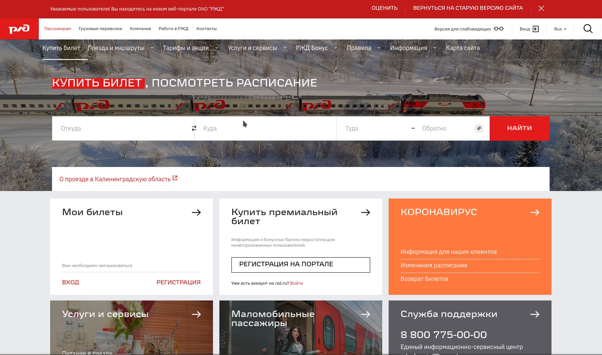

Для начала нужно выбрать направление поездки.

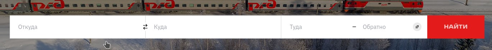

В поле [big]#_"откуда"_# следует указать город отправления, а в поле [big]#_"куда"_# вводится место прибытия. Следующими заполняются поля [big]#_"туда"_# и [big]#_"обратно"_#, которые отвечают за дату отбытия и прибытия.

В случае, если обратный билет не требуется, заполняется только поле [big]#_"туда"_#.

[red big]#Обратите особое внимание на *дату отправления*. Билеты на многие направления разрешается бронировать *не менее чем за 45 или 90 суток* до даты отправления.#

Заполненное поле поиска должно выглядеть похожим образом: 

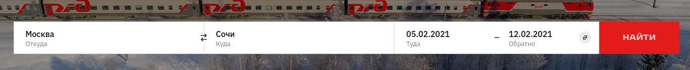

После заполнения проверьте правильность введенных данных и нажмите на кнопку [big]#_"Найти"_#. Начнется поиск доступных рейсов.

[[anchor-2]]

=== Результат поиска

После завершения поиска появятся результаты:

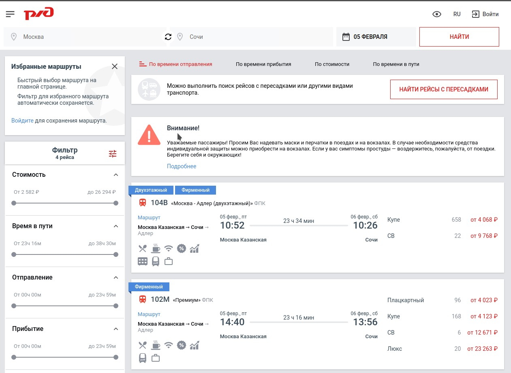

В центре страницы будут показаны доступные *типы* и *направления* поездов. Каждый поезд отображается в отдельном прямоугольнике, в котором также показаны *время убытия* и *прибытия*. Также можно сразу увидеть *начальные цены* на свободные категории мест (*купе, СВ, плацкарт* и т.д.)

Если нужно изменить критерии поиска, то это можно сделать в верхней части страницы.

Также доступен вариант выбора *рейсов с пересадками*. Их можно увидеть нажав кнопку [big]#_"Найти рейсы с пересадками"_#.

Появятся *рейсы*, доступные для покупки во вкладке [big]#_"Cоставные рейсы"_#:

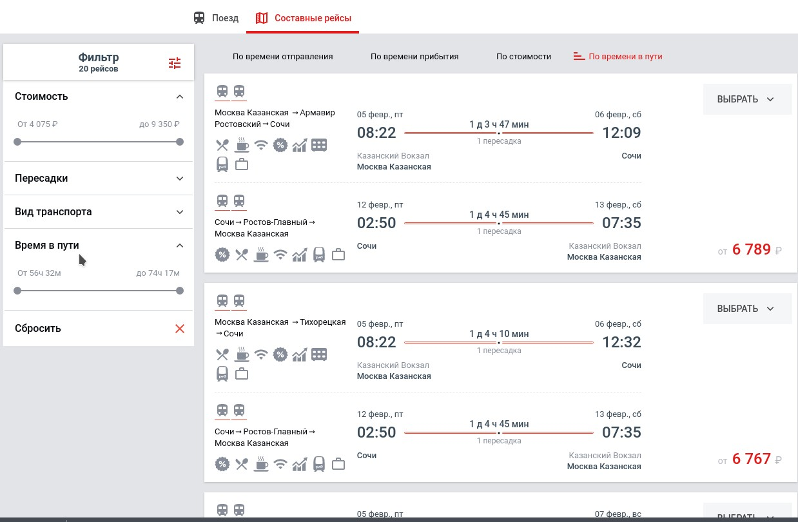

[[anchor-3]]

=== Фильтр

На странице <<anchor-2, результатов поиска>> также можно использовать *фильтры* для облегчения поиска подходящего поезда.

[frame="none",grid="none"]
|=====
|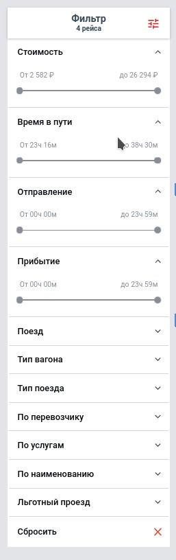|Для настройки фильтра доступны следующие параметры: +

[big]#*Стоимость*# +

[big]#*Время в пути*# +

[big]#*Отправление*# +

[big]#*Прибытие*# + 

и т. д.

Результ поиска всегда можно настроить. Например, если пассажиру требуется прибыть к определенному времени, то указав время он увидит рейсы, которые прибудут в желаемый срок.

Можно отменить действия параметров, указанных в фильтре, с помощью кнопки [big]#_"Сбросить"_#.
|=====

[[anchor-4]]

=== Выбор класса обслуживания и места в вагоне

После выбора подходящего рейса из предложенных в <<anchor-2, результатах поиска>>, появится возможность выбрать *класс обслуживания в вагоне*.

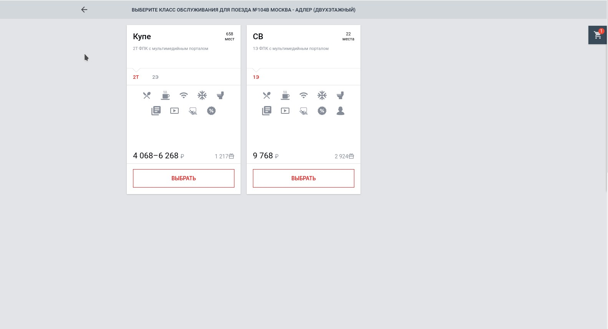

Кнопка [big]#_"Выбрать"_# покажет *схему вагона* с возможностью отметить место в вагоне нажатием *левой кнопки мыши*:

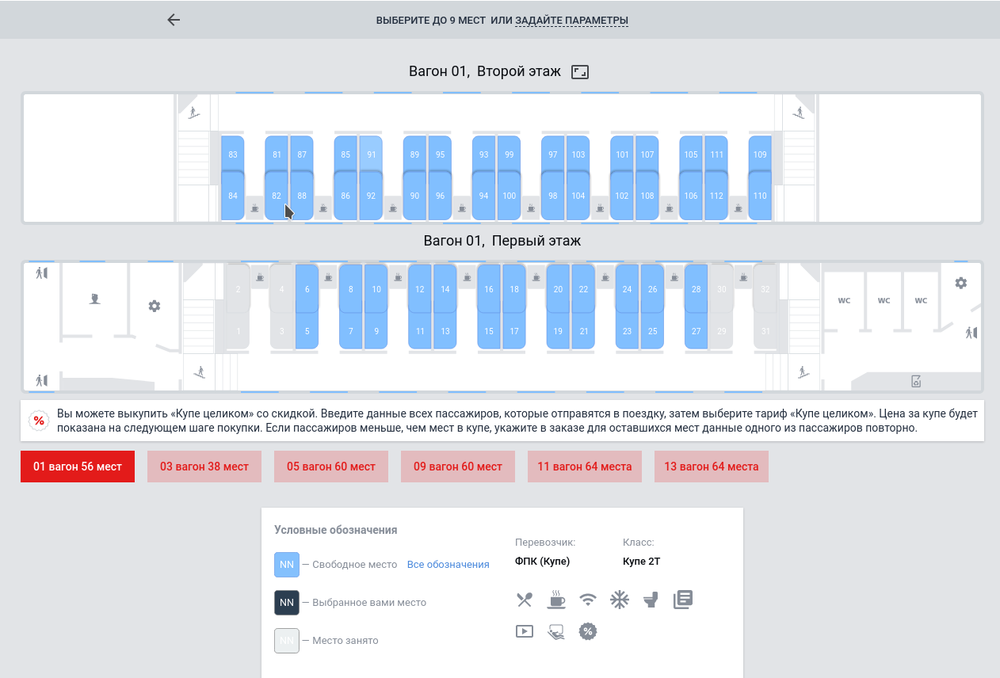

Если навести курсор на место в вагоне, то появится всплывающая подсказка с *описанием этого места* и *ценой*:

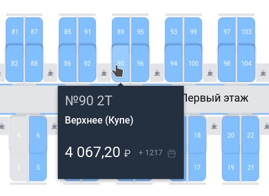

Посмотреть доступные места в других вагонах можно с помощью *соотвествующих кнопок*:

[[anchor-5]]

=== Регистрация пассажиров и оплата

После <<anchor-3,выбора места>> появится возможность *ввести данные пассажира* (или пассажиров, если путешествуют несколько человек):

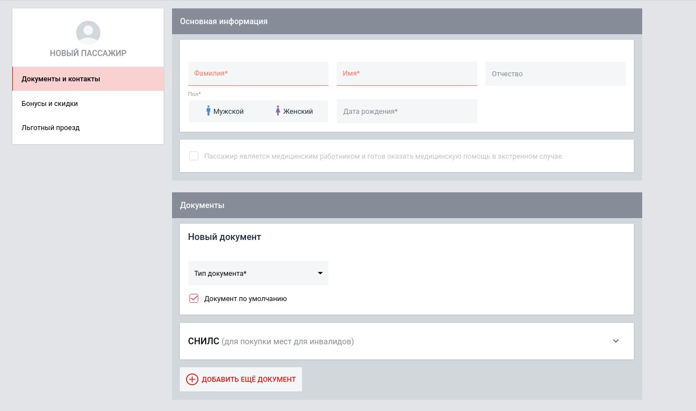

[red big]#Обязательно *проверьте правильность введенных данных*. Сотрудники поезда вправе *отказать в предоставлении услуг при несовпадении указанных при бронировании данных с предъявленным документом*.#

После регистрации пассажиров появится возможность *оплатить заказ*. Для этого следует нажать на кнопку [big]#_"Оформить заказ"_#.

Также можно будет добавить другие поездки с помощью *соответсвующей кнопки*.

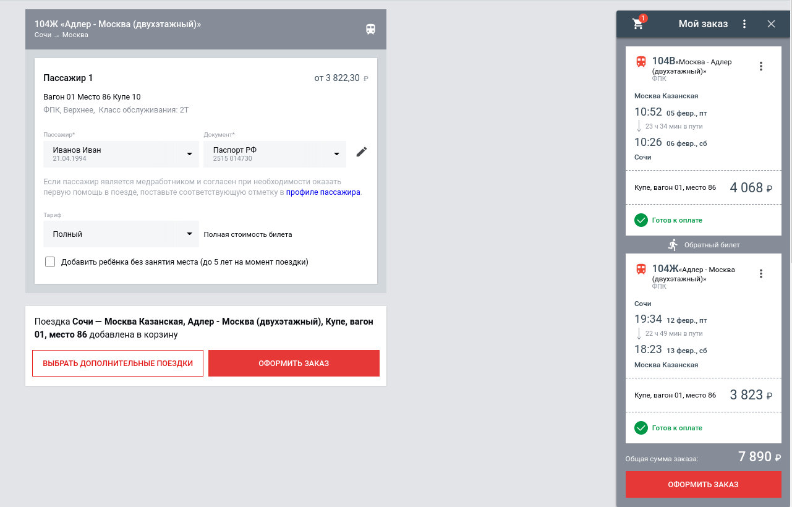

В правой части экрана отображаются все рейсы и детали поездки.

После нажатии кнопки [big]#_"Оформить заказ"_# появится *форма подтверждения заказа*, где можно будет повторно убедиться в верности введенных данных, правильности выбранного маршрута и времени отправки/прибытия.

[red big]#*Обратите внимание*, что оплатить заказ нужно *в течение 10 минут*, иначе он будет автоматически отменен.#

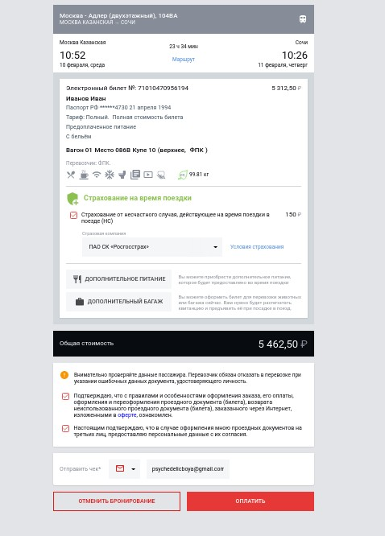

Для продолжения нажмите на кнопку "Оплатить".

Появится страница, где можно будет ввести данные банковской карты для оплаты заказа.

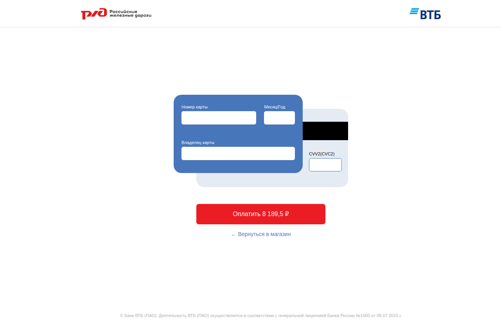

К оплате принимаются карты VISA, Mastercard, UnionPay и МИР.

После оплаты появится оповещение об успешном окончании операции. Через несколько минут на указанный номер телефона придет смс с информацией о заказе. Электронный билет отправляется на указанный при бронировании адресс электронной почты.

На этом покупка билета завершена, надеемся, что ваше путешествие будет приятным.
